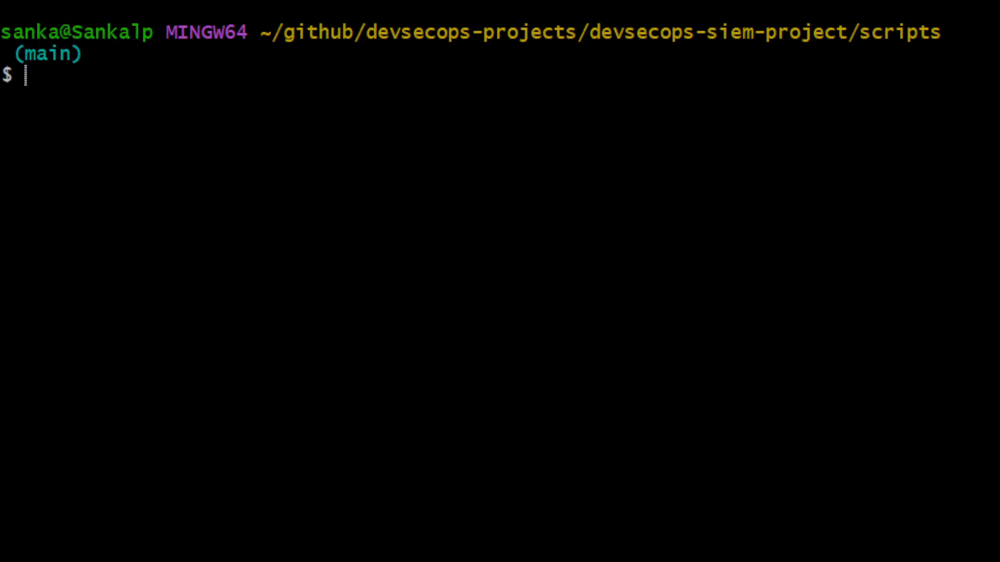

# 🛡 DevSecOps SIEM Platform

> A cloud-native DevSecOps platform built from scratch — integrating CI/CD automation, container orchestration, infrastructure as code, and real-time security monitoring into a single production-style system.

Built independently after completing a DevOps training programme, extending the course curriculum with Docker, Kubernetes, Terraform, AWS EC2, MongoDB, and a custom-built professional SIEM dashboard.

---

## 📋 Table of Contents

| Section | Description |
|---|---|
| [🏗 Architecture](#-architecture) | System design and component overview |
| [🚀 Tech Stack](#-tech-stack) | Technologies used and their purpose |
| [📂 Project Structure](#-project-structure) | Repository layout |
| [⚡ Quick Start](#-quick-start) | Get the platform running in minutes |
| [🔄 CI/CD Pipeline](#-cicd-pipeline) | Automated build, push and deploy flow |
| [🛡 SIEM Dashboard](#-siem-dashboard) | Professional security monitoring dashboard |
| [🗄 MongoDB Storage](#-mongodb-storage) | Persistent log storage |
| [🖥 Host Log Shipping](#-host-log-shipping) | Real-time local machine monitoring |
| [☁ AWS EC2 + Terraform](#-aws-ec2--terraform) | Infrastructure as Code and cloud logging |
| [📊 Kubernetes](#-kubernetes) | Orchestration and self-healing pods |
| [🔮 Roadmap](#-roadmap) | Planned improvements |
| [📖 Documentation](#-documentation) | Full documentation suite |

---

## 🏗 Architecture

```
Developer Workstation (Sankalp)
        │
        ├── Host Log Shipper ──────────────────────────┐
        │   (CPU, Memory, Network, Processes)          │
        │                                              ▼
        ▼                                    SIEM Dashboard
   GitHub Repository                         (Node.js + MongoDB)
        │  webhook on every push                       ▲
        ▼                                              │
   ngrok Tunnel                             AWS EC2 Instance
        │                                  provisioned via Terraform
        ▼                                  ships real system logs
   Jenkins CI/CD (Docker container)
        │
        ├── Job 1: Build Docker Image
        ├── Job 2: Push to DockerHub
        └── Job 3: Deploy to Kubernetes
                         │
                         ▼
              Kubernetes Cluster
              (2 replicas + MongoDB pod)
```

---

## 🚀 Tech Stack

| Layer | Technology | Purpose |
|---|---|---|
| Source Control | GitHub | Version control + webhook triggers |
| CI/CD | Jenkins | Automated build, push, deploy pipeline |
| Containerisation | Docker | Application packaging + DockerHub registry |
| Orchestration | Kubernetes | Pod management, scaling, self-healing |
| Infrastructure as Code | Terraform | EC2 provisioning — no manual AWS console |
| Cloud Compute | AWS EC2 | Cloud instance shipping real logs to SIEM |
| Tunnelling | ngrok | Exposes local Jenkins via public HTTPS URL |
| Database | MongoDB | Persistent log storage inside Kubernetes |
| Security Monitoring | Custom Node.js SIEM | Real-time multi-source event dashboard |
| Host Monitoring | Bash log shipper | Continuous local machine metrics to SIEM |

---

## 📂 Project Structure

```
devsecops-siem-project/
│
├── app/                        # SIEM dashboard application
│   ├── app.js                  # Express server — REST API + dashboard UI
│   ├── Dockerfile              # Container definition
│   └── package.json
│
├── ec2/                        # AWS EC2 scripts
│   ├── ec2-activity.sh         # Ships real system activity to SIEM
│   └── ec2-alerts.sh           # Injects simulated alert events
│
├── jenkins/                    # CI/CD pipeline
│   └── Jenkinsfile             # 3-job pipeline definition
│
├── k8s/                        # Kubernetes manifests
│   ├── deployment.yaml         # 2-replica SIEM app deployment
│   ├── mongodb-deployment.yaml # MongoDB pod + ClusterIP service
│   ├── service.yaml            # NodePort service
│   └── ingress.yaml            # Ingress configuration
│
├── scripts/                    # Platform automation
│   ├── start-platform.sh       # Single-command startup (all services)
│   ├── stop-platform.sh        # Clean shutdown (all services)
│   ├── inject-demo-logs.sh     # Demo log injection
│   └── host-log-shipper.sh     # Continuous Windows host log shipper
│
├── terraform/                  # Infrastructure as Code
│   ├── main.tf                 # VPC, subnet, security group, EC2, key pair
│   ├── variables.tf            # Input variables
│   ├── outputs.tf              # EC2 IP, DNS, SSH command
│   └── user_data/
│       └── bootstrap.sh        # EC2 auto-bootstrap script
│
└── docs/                       # Full documentation
```

---

## ⚡ Quick Start

### Prerequisites

- Docker Desktop with Kubernetes enabled
- Git Bash (Windows) or Terminal (Mac/Linux)
- ngrok free account
- AWS free tier account
- Terraform v1.0+

### Start the platform

```bash
git clone https://github.com/sankalpdevopstrain/devsecops-siem-project.git
cd devsecops-siem-project
./scripts/start-platform.sh
```

### 📸 Live Demo — Platform Startup


*One command starts the entire platform — Jenkins, SIEM dashboard, ngrok tunnel, and host log shipper — all running in under a minute.*

### Access the platform

| Service | URL |
|---|---|
| Jenkins | http://localhost:8080 |
| SIEM Dashboard | http://localhost:8081 |
| ngrok Web UI | http://127.0.0.1:4040 |

### Inject demo logs

```bash
./scripts/inject-demo-logs.sh
```

### Stop the platform

```bash
./scripts/stop-platform.sh
```

---

## 🔄 CI/CD Pipeline

Every `git push` automatically triggers the full pipeline via GitHub webhook:

```
git push origin main
      │
      ▼
GitHub Webhook → ngrok → Jenkins
      │
      ├── Job 1 — CI Build
      │         docker build -t devsecops-app:latest .
      │
      ├── Job 2 — CD Push
      │         docker push sankalpdevops/devsecops-app:latest
      │
      └── Job 3 — CD Deploy
                kubectl apply -f k8s/
                kubectl rollout restart deployment devsecops-app
```

### 📸 Live Demo — CI/CD Pipeline


*A git push automatically triggers the full Jenkins pipeline — build, push to DockerHub, deploy to Kubernetes — with zero manual intervention.*

---

## 🛡 SIEM Dashboard

A professional-grade security monitoring dashboard ingesting real-time events from multiple sources, with persistent MongoDB storage, severity classification, live charts, and multi-source filtering.

### 📸 Live Demo — SIEM Dashboard


*Live severity classification across the SIEM dashboard — events colour-coded in real time by threat level.*

### Dashboard Features

| Feature | Description |
|---|---|
| Stat Cards | Total events, Critical, High, Low, Active Alerts, Active Sources |
| Live Host Metrics | Real-time TCP connections and process count per host |
| Filter Bar | Filter by severity, source, and event type |
| Event Log Table | Timestamp, severity badge, source badge, host name, type, message |
| Severity Chart | Doughnut chart — Critical / High / Low percentage breakdown |
| Source Chart | Doughnut chart — event distribution by log source |
| Active Sources | Live list of connected sources with event counts |
| Auto-Refresh | Dashboard refreshes every 15 seconds automatically |

### Severity Classification

| Condition | Severity |
|---|---|
| `type: failed_login` | HIGH |
| `level: error` | CRITICAL |
| `type: login_success` | LOW |
| `type: health_check` | LOW |
| `process_count > 300` | HIGH |
| `cpu_pct > 85` | CRITICAL |

### Log Sources

- **Windows Host** — local machine uptime, disk usage, system metrics
- **Windows Network** — active TCP connection count
- **Windows Process** — running process count
- **Jenkins** — build and deployment events
- **GitHub** — webhook push events
- **Kubernetes** — deployment status events
- **AWS EC2** — real cloud system logs via ngrok tunnel

### API Endpoints

```
POST   /logs            Ingest a log event
GET    /logs            Retrieve all logs (JSON)
DELETE /logs            Clear all logs from MongoDB
GET    /health          Health check + MongoDB status
GET    /                Live dashboard UI
POST   /github-webhook  GitHub webhook receiver
```

---

## 🗄 MongoDB Storage

Log events are stored persistently in MongoDB running as a Kubernetes pod — replacing the previous in-memory storage that lost all data on pod restart.

```bash
kubectl get pods
# NAME                             READY   STATUS
# devsecops-app-xxx                1/1     Running
# devsecops-app-xxx                1/1     Running
# mongodb-xxx                      1/1     Running
```

Logs survive pod restarts, redeployments, and crashes. The `DELETE /logs` endpoint is the only way to clear the dashboard.

---

## 🖥 Host Log Shipping

A continuous bash script (`scripts/host-log-shipper.sh`) runs in the background and ships real Windows system events to the SIEM every 10 seconds:

- **Active TCP connections** — network activity monitoring
- **Running process count** — system load indicator
- **Disk usage** — C: drive capacity monitoring
- **System uptime** — availability tracking

The shipper includes **offline buffering** — if the SIEM is unreachable, logs are queued locally and automatically replayed when the connection is restored.

```bash
# Starts automatically with the platform
./scripts/start-platform.sh

# Or run manually in a separate window
./scripts/host-log-shipper.sh
```

---

## ☁ AWS EC2 + Terraform

The EC2 instance is provisioned entirely via Terraform — no manual clicking in the AWS console.

```bash
cd terraform/
terraform init
terraform plan
terraform apply
```

Provisions: VPC, public subnet, internet gateway, security group, SSH key pair, t3.micro EC2 (Ubuntu 26.04 LTS), and a bootstrap script that auto-installs Docker and Node.js.

### 📸 Live Demo — EC2 Real Logs to SIEM


*Real system commands run on a live AWS EC2 instance — logs shipped directly to the SIEM dashboard via ngrok tunnel.*

### Shipping real EC2 logs to the SIEM

```bash
ssh -i ~/.ssh/devsecops-key.pem ubuntu@<EC2_PUBLIC_IP>

# Built-in log helper — ships directly to SIEM dashboard
log "System update completed"
sudo apt-get update && log "apt-get update ran successfully"
```

### Tear down when finished

```bash
terraform destroy
```

---

## 📊 Kubernetes

### 📸 Live Demo — Kubernetes



*Two replicas running with self-healing infrastructure — Kubernetes automatically restarts any failed pod.*

```bash
kubectl get pods          # Check running pods (2 app replicas + MongoDB)
kubectl get deployments   # Check deployment status
kubectl get svc           # Check service exposure
```

---

## 🔮 Roadmap

- [x] Persistent log storage — MongoDB in Kubernetes
- [x] Auto-refresh SIEM dashboard
- [x] Professional cybersecurity dashboard with charts and filters
- [x] Multi-source log ingestion (Windows host, EC2, Jenkins, GitHub, Kubernetes)
- [ ] CloudWatch + SNS email alerts
- [ ] Ansible EC2 configuration management
- [ ] Jenkins deployed to EC2 via Terraform
- [ ] GitHub Actions as alternative CI/CD layer

---

## 📖 Documentation

| Doc | Description |
|---|---|
| [Project Overview](docs/01-project-overview.md) | Goals, business problem, skills demonstrated |
| [Architecture](docs/02-architecture.md) | System design and component decisions |
| [Jenkins Pipeline](docs/03-jenkins-pipeline.md) | CI/CD pipeline setup and job flow |
| [Docker Build](docs/04-docker-build.md) | Containerisation process |
| [Kubernetes Deployment](docs/05-kubernetes-deployment.md) | Orchestration setup |
| [SIEM Dashboard](docs/06-siem-dashboard.md) | Security monitoring layer |
| [Webhook Integration](docs/07-webhook-integration.md) | GitHub to Jenkins automation |
| [Terraform + EC2](docs/08-terraform-ec2.md) | Infrastructure as Code and cloud logging |
| [Final Demo](docs/09-final-demo.md) | End-to-end platform walkthrough |
| [MongoDB Storage](docs/10-mongodb-storage.md) | Persistent log storage implementation |
| [Professional SIEM Dashboard](docs/11-siem-dashboard-professional.md) | Dashboard upgrade — charts, filters, host metrics |

---

## 👤 Author

**Sankalp Hiregoudar**
GitHub: [@sankalpdevopstrain](https://github.com/sankalpdevopstrain)

*Built as a self-directed portfolio project after completing a DevOps training programme — demonstrating practical DevSecOps engineering beyond the course curriculum.*

---

## 📄 Licence

MIT — see [CONTRIBUTING.md](CONTRIBUTING.md) for contribution guidelines.
