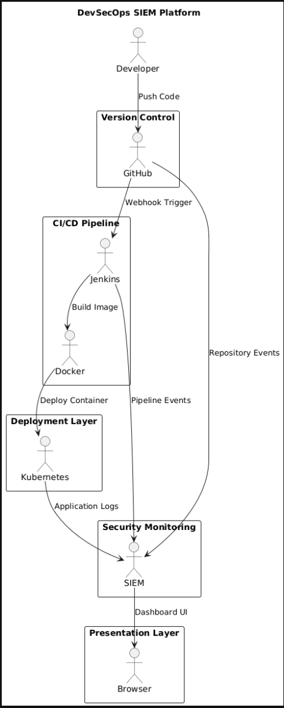

# 🛡 Project Overview

> DevSecOps SIEM Platform — Cloud-Native CI/CD Automation with Real-Time Security Monitoring

---

## Project Summary

This project was built to simulate a real-world DevSecOps environment where application delivery, infrastructure automation, and security monitoring operate as a single integrated platform.

It was developed independently after completing a DevOps training programme, extending the curriculum with Docker, Kubernetes, Terraform, and a custom-built SIEM dashboard — technologies not covered in the course.

The platform demonstrates the complete software delivery lifecycle:

```
Code Commit → Webhook Trigger → CI Build → Docker Image → Kubernetes Deploy → SIEM Monitoring
```

---

## Business Problem

In many organisations, development, operations, and security teams work in silos. This creates:

- Slow, error-prone manual deployments
- Poor visibility into infrastructure events
- Delayed detection of security incidents
- Weak operational traceability

This platform solves those problems by integrating all three disciplines into one automated, observable system.

---

## Technical Objectives

| Objective | Implementation |
|---|---|
| Automate CI/CD | Jenkins 3-job pipeline triggered by GitHub webhook |
| Containerise the application | Docker image built and pushed to DockerHub |
| Orchestrate workloads | Kubernetes deployment with 2 replicas |
| Provision cloud infrastructure | AWS EC2 via Terraform (Infrastructure as Code) |
| Monitor security events | Custom Node.js SIEM dashboard |
| Ship real cloud logs | EC2 → ngrok → SIEM dashboard |

---

## Skills Demonstrated

- DevSecOps engineering
- CI/CD pipeline automation
- Linux operations
- Docker containerisation
- Kubernetes orchestration
- GitHub webhook integration
- Infrastructure as Code (Terraform)
- AWS EC2 provisioning
- Node.js backend development
- Security event monitoring
- Bash scripting and platform automation

---

## Architecture Overview



The architecture follows a secure, event-driven DevSecOps delivery model.

A developer pushes code to GitHub, which fires a webhook to Jenkins via an ngrok tunnel. Jenkins runs three chained jobs — building the Docker image, pushing it to DockerHub, and deploying it to Kubernetes. Simultaneously, an AWS EC2 instance provisioned via Terraform ships real system logs through the ngrok tunnel into the custom SIEM dashboard, providing live security visibility across the entire platform.
