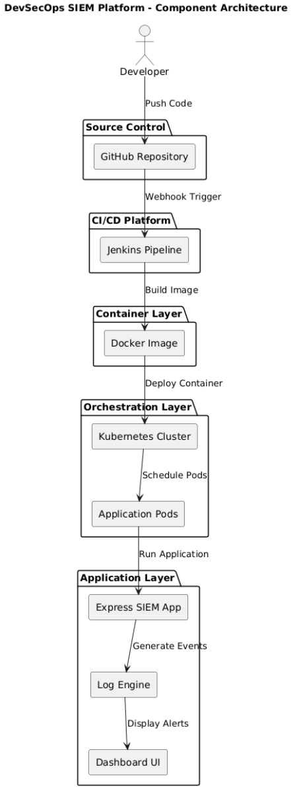

# System Architecture and Design Decisions
- [System Architecture and Design Decisions](#system-architecture-and-design-decisions)
  - [Architecture Goal](#architecture-goal)
  - [Core Components](#core-components)
    - [1. Source Control Layer](#1-source-control-layer)
    - [2. CI/CD Layer](#2-cicd-layer)
    - [3. Containerisation Layer](#3-containerisation-layer)
    - [4. Orchestration Layer](#4-orchestration-layer)
    - [5. Security Monitoring Layer](#5-security-monitoring-layer)
  - [Design Decisions](#design-decisions)
  - [Architecture Considerations](#architecture-considerations)
  - [Component Architecture Diagram](#component-architecture-diagram)
  - [Diagram Explanation](#diagram-explanation)

## Architecture Goal

The primary goal of this architecture was to build a secure, scalable, and automated DevSecOps platform capable of:

- Continuous integration and deployment
- Container-based application delivery
- Event-driven automation
- Real-time security event monitoring

---

## Core Components

### 1. Source Control Layer

Code is maintained in the repository hosted on GitHub.

Responsibilities:

- Version control
- Branch management
- Commit history
- Webhook event generation

Security Benefits:

- Full change traceability
- Auditability of commits
- Secure collaboration

---

### 2. CI/CD Layer

Jenkins was selected as the automation engine.

Responsibilities:

- Pull source code
- Execute pipeline stages
- Build Docker containers
- Trigger Kubernetes deployment

Security Benefits:

- Reduced manual deployment risk
- Repeatable deployment workflows
- Controlled release process

---

### 3. Containerisation Layer

Docker was used to package the application.

Responsibilities:

- Environment consistency
- Dependency isolation
- Portable deployments

Security Benefits:

- Reduced configuration drift
- Predictable runtime behaviour

---

### 4. Orchestration Layer

Kubernetes was used to manage application workloads.

Responsibilities:

- Pod scheduling
- Service discovery
- High availability
- Scaling

Security Benefits:

- Self-healing workloads
- Reduced downtime
- Improved operational resilience

---

### 5. Security Monitoring Layer

The custom SIEM dashboard collects and displays security events.

Log Sources:

- Application logs
- Authentication events
- Jenkins pipeline events
- GitHub webhook events

Security Benefits:

- Faster threat visibility
- Centralised event monitoring
- Alert generation

---

## Design Decisions

| Decision | Reason |
|----------|--------|
| Node.js backend | Lightweight and event-driven |
| Docker containers | Portable deployment model |
| Kubernetes | Production-style orchestration |
| Jenkins | Industry-standard CI/CD |
| GitHub webhooks | Real-time automation |

---

## Architecture Considerations

The platform was designed with the following engineering principles:

- Scalability
- Automation
- Security visibility
- Operational resilience
- Observability
--
## Component Architecture Diagram

## Diagram Explanation

This diagram illustrates the internal architecture of the DevSecOps SIEM platform and how each core component interacts throughout the software delivery lifecycle.

The process begins when a developer pushes source code changes to GitHub. A webhook event is then generated, automatically triggering the Jenkins pipeline.

Jenkins performs the CI/CD workflow, which includes:

- Pulling the latest source code
- Validating the build
- Creating the Docker container image
- Preparing the application for deployment

Once the image is successfully built, it is deployed into the Kubernetes environment, where pods are created and scheduled automatically.

Inside the running containers, the Express-based SIEM application processes incoming events and generates runtime security telemetry.

These logs are passed into the internal log engine, where events such as authentication failures, webhook activity, and application events are analysed and classified.

Finally, processed events are displayed through the browser-based dashboard, allowing security events and operational alerts to be monitored in real time.

This architecture demonstrates secure automation, operational resilience, and continuous security visibility across the full application lifecycle.

