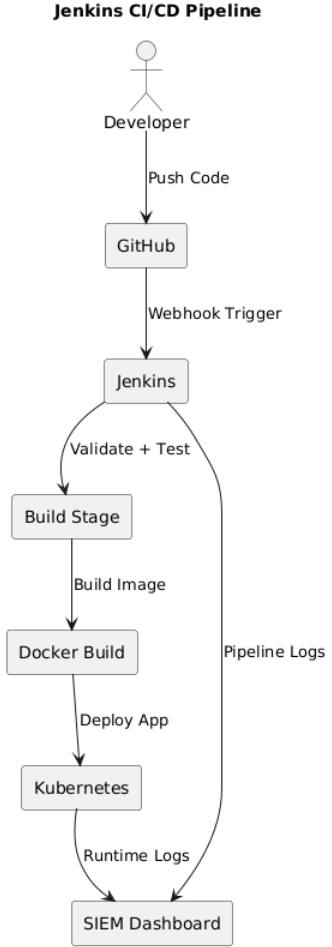

# Jenkins CI/CD Pipeline
- [Jenkins CI/CD Pipeline](#jenkins-cicd-pipeline)
  - [Pipeline Objective](#pipeline-objective)
  - [Pipeline Architecture](#pipeline-architecture)
  - [Pipeline Stages](#pipeline-stages)
  - [Stage 1 — Source Code Checkout](#stage-1--source-code-checkout)
  - [Stage 2 — Application Build](#stage-2--application-build)
  - [Stage 3 — Docker Build](#stage-3--docker-build)
  - [Stage 4 — Kubernetes Deployment](#stage-4--kubernetes-deployment)
  - [Stage 5 — Security Logging](#stage-5--security-logging)
  - [Implementation Steps](#implementation-steps)
    - [Step 1](#step-1)
    - [Step 2](#step-2)
    - [Step 3](#step-3)
    - [Step 4](#step-4)
    - [Step 5](#step-5)
  - [Pipeline Job Flow](#pipeline-job-flow)
    - [Job 1 — CI Build](#job-1--ci-build)
    - [Job 2 — CD Push](#job-2--cd-push)
    - [Job 3 — CD Deploy](#job-3--cd-deploy)
  - [Security Considerations](#security-considerations)
  - [Pipeline Diagram](#pipeline-diagram)
  - [Diagram Explanation](#diagram-explanation)

---

## Pipeline Objective

Jenkins was implemented as the CI/CD automation engine for this project to enable secure and repeatable application delivery.

The objective was to automatically:

- Pull source code from GitHub
- Build and validate the application
- Build container images
- Deploy workloads into Kubernetes
- Generate operational and security logs

This removed manual deployment steps and created a production-style delivery workflow.

---

## Pipeline Architecture

The Jenkins pipeline follows an event-driven architecture.

Whenever source code is pushed to GitHub, a webhook automatically triggers Jenkins.

Jenkins then executes multiple deployment jobs in sequence.

This ensures:

- Faster deployments
- Consistent build validation
- Reduced human error
- Better operational visibility

---

## Pipeline Stages

## Stage 1 — Source Code Checkout

Jenkins pulls the latest source code from GitHub.

Tasks performed:

- Repository cloning
- Branch validation
- Commit tracking

Purpose:

To ensure Jenkins always builds from the latest trusted source.

---

## Stage 2 — Application Build

The application is prepared for deployment.

Tasks performed:

- Install Node.js dependencies
- Validate application structure
- Confirm successful startup

Commands used:

```bash
npm install
npm start
```

Purpose:

To validate application integrity before containerisation.

---

## Stage 3 — Docker Build

The application is containerised.

Tasks performed:

- Build Docker image
- Tag image
- Prepare deployment artifact

Command used:

```bash
docker build -t devsecops-siem-app .
```

Purpose:

To package the application into a portable deployment unit.

---

## Stage 4 — Kubernetes Deployment

The application is deployed into Kubernetes.

Tasks performed:

- Apply deployment manifests
- Restart workloads
- Validate pod health

Commands used:

```bash
kubectl apply -f k8s/
kubectl rollout restart deployment devsecops-app
```

Purpose:

To deploy the application into a resilient orchestration platform.

---

## Stage 5 — Security Logging

Jenkins pipeline activity is integrated into the SIEM dashboard.

Examples of monitored events:

- Build success
- Build failure
- Deployment success
- Deployment errors

Purpose:

To provide real-time operational security visibility.

---

## Implementation Steps

### Step 1

Installed Jenkins on AWS EC2.

### Step 2

Configured GitHub webhook integration.

### Step 3

Created multiple Jenkins jobs to simulate an enterprise CI/CD workflow:

- CI Build Job
- CD Push Job
- CD Deploy Job

### Step 4

Configured Docker and Kubernetes access inside Jenkins.

### Step 5

Integrated deployment events into the SIEM monitoring platform.

---

## Pipeline Job Flow

The Jenkins implementation was designed using multiple independent jobs.

This modular architecture improves troubleshooting, scalability, and operational control.

### Job 1 — CI Build

Responsibilities:

- Pull latest code from GitHub
- Install dependencies
- Validate application startup

### Job 2 — CD Push

Responsibilities:

- Build Docker image
- Tag container image
- Prepare deployment artifact

### Job 3 — CD Deploy

Responsibilities:

- Deploy updated containers into Kubernetes
- Restart workloads
- Validate deployment success

This design reflects real-world enterprise CI/CD engineering practices.

---

## Security Considerations

The Jenkins environment was configured with security best practices:

- Controlled repository access
- Credential management
- Build traceability
- Automated deployment validation
- Reduced manual intervention

This improves both operational security and deployment consistency.

---

## Pipeline Diagram



---

## Diagram Explanation

The pipeline begins when a developer pushes source code changes to GitHub.

GitHub sends a webhook event to Jenkins, automatically triggering the CI build job.

Once the build succeeds:

The workflow progresses through:

1. CI Build Validation
2. Docker Image Build
3. Deployment Preparation
4. Kubernetes Deployment

During each phase, Jenkins generates operational telemetry.

These events are forwarded into the SIEM dashboard, where build activity, deployment status, and operational issues can be monitored in real time.

This architecture demonstrates secure automation, deployment resilience, and continuous operational visibility.