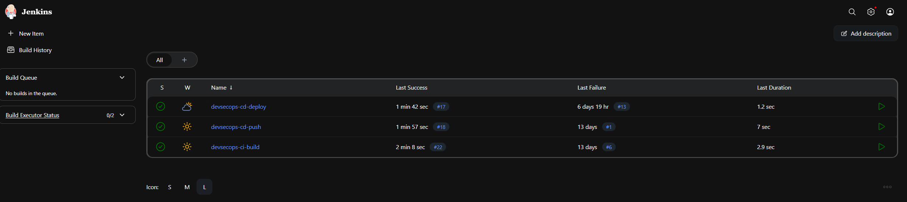
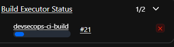
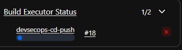
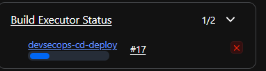

# ⚙ Jenkins CI/CD Pipeline

---

## Overview

Jenkins was chosen as the CI/CD engine because it gives full pipeline control and reflects real enterprise adoption. It runs as a Docker container on port 8080 and is triggered automatically by GitHub webhooks via ngrok.

The pipeline is split into three independent, chained jobs — reflecting a modular, production-style approach rather than a single monolithic script.

---

## Pipeline Diagram


---

## Pipeline Flow

```
GitHub Push
    │
    ▼
Webhook → ngrok → Jenkins
    │
    ▼
Job 1: devsecops-ci-build
    │  pulls code, builds Docker image
    ▼
Job 2: devsecops-cd-push
    │  tags and pushes image to DockerHub
    ▼
Job 3: devsecops-cd-deploy
       applies k8s manifests, restarts deployment
```

---

## Job 1 — CI Build

**Purpose:** Validate the application and build the Docker image.

**What it does:**
- Cleans the Jenkins workspace
- Clones the latest code from GitHub
- Runs `docker build -t devsecops-app:latest .` inside the `app/` directory
- Verifies the image exists with `docker images`
- Triggers Job 2 on success

**Evidence:**

```
Started by GitHub push by sankalpdevopstrain
Building in workspace /var/jenkins_home/workspace/devsecops-ci-build
docker build -t devsecops-app:latest .
JOB1 COMPLETE
Triggering a new build of devsecops-cd-push
Finished: SUCCESS
```

---

## Job 2 — CD Push

**Purpose:** Tag the image and push it to DockerHub.

**What it does:**
- Tags the built image as `sankalpdevops/devsecops-app:latest`
- Logs into DockerHub
- Pushes the image to the registry
- Triggers Job 3 on success

**Evidence:**

```
Tagging image...
Logging into DockerHub...
Login Succeeded
Pushing image...
latest: digest: sha256:ba7473bfb119... size: 856
DONE - Image pushed successfully
Triggering a new build of devsecops-cd-deploy
Finished: SUCCESS
```

---

## Job 3 — CD Deploy

**Purpose:** Deploy the updated application to Kubernetes.

**What it does:**
- Checks out the latest code
- Applies `deployment.yaml`, `service.yaml`, and `ingress.yaml`
- Kubernetes updates the running pods with the new image

**Evidence:**

```
Applying Kubernetes manifests individually...
deployment.apps/devsecops-app unchanged
service/devsecops-app-service unchanged
ingress.networking.k8s.io/devsecops-app-ingress unchanged
===== DEPLOYMENT COMPLETE =====
Finished: SUCCESS
```

---

## Webhook Trigger Proof

The pipeline is triggered automatically — not manually. This is proven by the Jenkins console output:

```
Started by GitHub push by sankalpdevopstrain
```

And confirmed in GitHub webhook delivery logs showing a `200 OK` response in 0.94 seconds.

---

## Screenshots

**All 3 jobs running successfully:**



**Job 1 — CI Build:**



**Job 2 — CD Push:**



**Job 3 — CD Deploy:**


