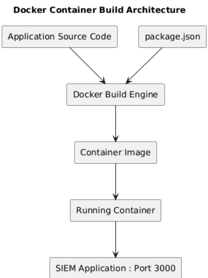

# 🐳 Docker Containerisation

---

## Overview

Docker is used to package the SIEM application into a portable, consistent container image. The same image is built by Jenkins, pushed to DockerHub, and deployed by Kubernetes — ensuring identical behaviour at every stage.

---

## Architecture Diagram



---

## Why Docker

Without containerisation, applications behave differently across environments due to dependency differences, OS versions, and configuration drift. Docker solves this by bundling everything the application needs into a single image.

**What the container includes:**
- Node.js 18 runtime
- Application source code (`app.js`)
- Installed npm dependencies (Express.js)
- Port 3000 exposed for the SIEM dashboard

---

## Dockerfile

```dockerfile
FROM node:18
WORKDIR /app
COPY package*.json ./
RUN npm install
COPY . .
EXPOSE 3000
CMD ["node", "app.js"]
```

---

## Build Process

Jenkins Job 1 runs the build automatically:

```bash
cd app/
docker build -t devsecops-app:latest .
```

After a successful build, the image is verified:

```bash
docker images | grep devsecops-app
# devsecops-app   latest   ba7473bfb119   1.58GB
```

---

## DockerHub Registry

Jenkins Job 2 tags and pushes the image to DockerHub:

```bash
docker tag devsecops-app:latest sankalpdevops/devsecops-app:latest
docker push sankalpdevops/devsecops-app:latest
```

This creates a versioned, publicly accessible image that Kubernetes pulls during deployment.

**Registry:** `docker.io/sankalpdevops/devsecops-app:latest`

---

## Runtime Validation

```bash
# Check the container is running inside Kubernetes
docker ps | grep jenkins

# Check the SIEM app container via kubectl
kubectl get pods
# devsecops-app-7d58c886cf-ffxsg   1/1   Running
# devsecops-app-7d58c886cf-vxsrm   1/1   Running
```

---

## Security Considerations

- Containers run in isolated environments — no host dependency exposure
- The Node.js base image is a well-maintained official image
- Image layers are cached, reducing build time and network exposure
- DockerHub credentials are stored in Jenkins credential store — not hardcoded in the pipeline
