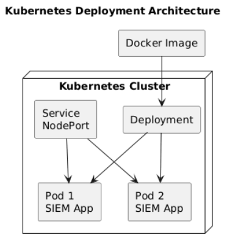

# Kubernetes Deployment and Orchestration

- [Kubernetes Deployment and Orchestration](#kubernetes-deployment-and-orchestration)
  - [Deployment Objective](#deployment-objective)
  - [Why Kubernetes Was Used](#why-kubernetes-was-used)
  - [Deployment Architecture](#deployment-architecture)
    - [Deployment Resource](#deployment-resource)
    - [Pod Layer](#pod-layer)
    - [Service Layer](#service-layer)
  - [Implementation Steps](#implementation-steps)
    - [Step 1](#step-1)
    - [Step 2](#step-2)
    - [Step 3](#step-3)
    - [Step 4](#step-4)
    - [Step 5](#step-5)
    - [Step 6](#step-6)
  - [Operational Validation](#operational-validation)
  - [Security Considerations](#security-considerations)
  - [Kubernetes Architecture Diagram](#kubernetes-architecture-diagram)
  - [Diagram Explanation](#diagram-explanation)

---

## Deployment Objective

Kubernetes was implemented to orchestrate and manage the SIEM application in a production-style container environment.

The objective was to provide:

- Automated workload scheduling
- High availability
- Service discovery
- Self-healing infrastructure
- Scalable deployments

---

## Why Kubernetes Was Used

Traditional container deployments often face operational limitations such as:

- Manual container restarts
- Service downtime
- Poor scaling
- Limited fault tolerance

Kubernetes solves these issues by managing application workloads automatically.

Key benefits:

- Automatic pod recovery
- Declarative infrastructure
- Centralised workload management
- Built-in service networking

---

## Deployment Architecture

The SIEM application was deployed using:

### Deployment Resource

Responsible for:

- Creating pods
- Maintaining replica count
- Restarting failed workloads

Example command:

```bash
kubectl get deployments
```

---

### Pod Layer

Pods host the running application containers.

Responsibilities:

- Running application workloads
- Receiving traffic
- Processing logs

Example command:

```bash
kubectl get pods
```

---

### Service Layer

A Kubernetes service was created to expose the application.

Responsibilities:

- Internal networking
- Traffic routing
- Stable endpoint access

Example command:

```bash
kubectl get svc
```

---

## Implementation Steps

### Step 1

Created Kubernetes deployment manifest.

### Step 2

Created Kubernetes service manifest.

### Step 3

Applied manifests to the cluster.

Command used:

```bash
kubectl apply -f k8s/
```

### Step 4

Verified running pods.

Command used:

```bash
kubectl get pods
```

### Step 5

Validated service exposure.

Command used:

```bash
kubectl port-forward svc/devsecops-app-service 8081:80
```

### Step 6

Accessed the SIEM dashboard through:

```bash
http://localhost:8081
```

---

## Operational Validation

The deployment was validated through:

- Pod health verification
- Service connectivity testing
- Application health checks
- Log ingestion testing

This confirmed successful deployment.

---

## Security Considerations

Kubernetes was configured to improve operational security by providing:

- Container isolation
- Automated workload recovery
- Reduced downtime
- Consistent deployments
- Controlled network exposure

This improves platform resilience.

---

## Kubernetes Architecture Diagram



---

## Diagram Explanation

The Kubernetes environment receives the container image built during the Docker stage.

A deployment resource then creates multiple pods running the SIEM application.

These pods are managed automatically by Kubernetes to ensure availability and recovery in case of failure.

A service resource exposes the application internally and forwards client requests to healthy pods.

Once traffic reaches the pods, the SIEM application processes incoming events and updates the dashboard in real time.

This architecture demonstrates production-style orchestration, fault tolerance, and operational scalability.