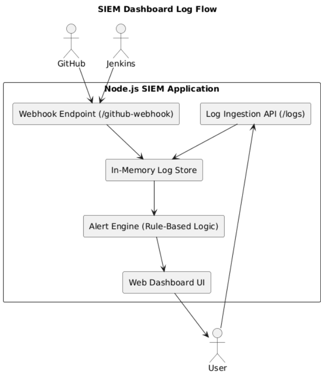

# 🛡 SIEM Dashboard

---

## Overview

The SIEM (Security Information and Event Management) dashboard is a custom-built security monitoring tool created from scratch using Node.js and Express. It collects events from multiple sources, classifies them by severity, and displays them in a live browser dashboard.

This is the part of the project that goes beyond standard DevOps — it adds security visibility directly into the delivery pipeline.

---

## Dashboard Architecture



---

## How It Works

```
Log Source (Jenkins / GitHub / EC2 / Manual)
        │
        ▼ HTTP POST /logs
Express REST API
        │
        ▼
In-Memory Log Store (array)
        │
        ▼
Alert Engine (severity classification)
        │
        ▼
Live Dashboard UI (browser at :8081)
```

---

## Severity Classification

The alert engine applies simple security rules to every incoming event:

| Condition | Severity | Visual |
|---|---|---|
| `type === "failed_login"` | HIGH | 🟥 Red left border |
| `level === "error"` | CRITICAL | 🔴 Red background |
| All other events | LOW | 🟩 Green left border |

This mirrors how enterprise SIEM platforms like Splunk apply correlation rules to classify events.

---

## API Endpoints

```
POST /logs            Ingest a security event (JSON body)
GET  /logs            Retrieve all stored events
GET  /health          Health check — returns { status: "OK" }
GET  /                Live dashboard UI
POST /github-webhook  Receives GitHub push events
```

### Example — Injecting a high severity event

```bash
curl -X POST http://localhost:8081/logs \
  -H "Content-Type: application/json" \
  -d '{"type":"failed_login","user":"admin","source_ip":"185.220.101.45"}'
```

Response:
```json
{
  "status": "received",
  "log": {
    "timestamp": "2026-05-22T11:44:03.944Z",
    "severity": "high",
    "type": "failed_login",
    "user": "admin",
    "source_ip": "185.220.101.45"
  }
}
```

---

## Log Sources

### Jenkins Events
Build success, build failure, and deployment completion events are generated by the CI/CD pipeline.

### GitHub Webhook Events
Every push to the repository is received at `/github-webhook` and logged as a low severity event.

### AWS EC2 — Real System Logs
The EC2 instance ships real system activity to the SIEM via the ngrok tunnel:

```bash
# On the EC2 instance
log "apt-get update completed"
log "Docker service restarted"
sudo apt-get upgrade -y && log "System packages upgraded"
```

### Simulated Alert Events
The `ec2-alerts.sh` script injects realistic high and critical events for demo purposes without affecting the EC2 machine.

---

## Dashboard Screenshots

**Initial state — no events:**


**Live events — alerts detected:**


---

## Security Value

Even as a lightweight simulation, this dashboard demonstrates core security engineering concepts:

- Centralised log collection from multiple sources
- Rule-based event correlation
- Real-time alert classification
- Operational visibility across CI/CD and cloud infrastructure
- Security embedded into the delivery pipeline — not separate from it

This mirrors the architecture of enterprise SOC platforms like Splunk, Microsoft Sentinel, and the ELK stack.

---

## Known Limitations and Roadmap

| Limitation | Planned Improvement |
|---|---|
| In-memory storage — logs lost on restart | Replace with MongoDB persistent storage |
| Dashboard requires manual refresh | Add WebSocket auto-refresh |
| No authentication on dashboard | Add basic auth layer |
| Single node deployment | Scale horizontally via Kubernetes |
