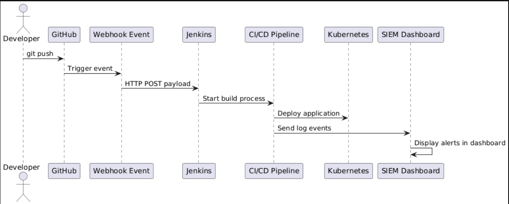

# 🔗 GitHub Webhook Integration

---

## Overview

GitHub webhooks create an event-driven CI/CD trigger — every `git push` automatically starts the Jenkins pipeline without any manual intervention. This is the core of the automation layer.

---

## Architecture Diagram



---

## How It Works

```
Developer runs: git push origin main
        │
        ▼
GitHub generates HTTP POST webhook event
        │  payload includes: commit, branch, author
        ▼
ngrok public URL receives the request
        │  https://previous-stinky-maturity.ngrok-free.dev/github-webhook/
        ▼
Jenkins receives and processes the event
        │
        ▼
CI/CD pipeline starts automatically
```

---

## GitHub Configuration

In the repository:

**Settings → Webhooks → Add webhook**

| Field | Value |
|---|---|
| Payload URL | `https://<ngrok-url>/github-webhook/` |
| Content type | `application/json` |
| Trigger | Push events |

---

## ngrok Tunnel

Because Jenkins runs locally, ngrok creates a secure public HTTPS URL that GitHub can reach:

```bash
ngrok start --all --config ~/ngrok.yml
```

The fixed free-plan subdomain means the webhook URL stays the same across every restart — no reconfiguration needed.

---

## Webhook Delivery Evidence

GitHub webhook delivery log showing successful delivery:

```
Request URL:   https://previous-stinky-maturity.ngrok-free.dev/github-webhook/
Response:      200 OK
Completed in:  0.94 seconds
X-Github-Event: push
```

Jenkins console confirming automatic trigger:

```
Started by GitHub push by sankalpdevopstrain
```

---

## End-to-End Test

To verify the webhook is working:

```bash
# Make an empty commit — no file changes needed
git commit --allow-empty -m "webhook test"
git push origin main
```

Then watch Jenkins at `http://localhost:8080` — Job 1 starts within seconds automatically.

---

## Security Considerations

- All webhook traffic is delivered over HTTPS via ngrok
- Jenkins is protected by authentication — unauthenticated users cannot access the UI
- The ngrok tunnel only forwards traffic to Jenkins — no other internal services are exposed
- Webhook secret can be added for payload verification (planned roadmap item)
