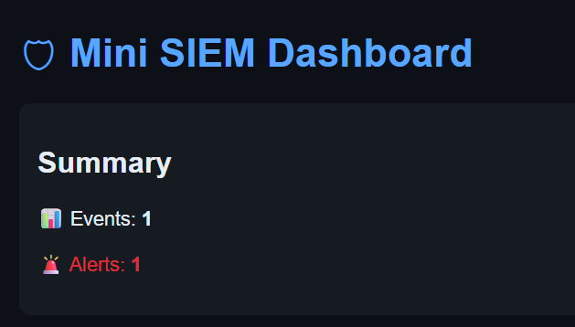
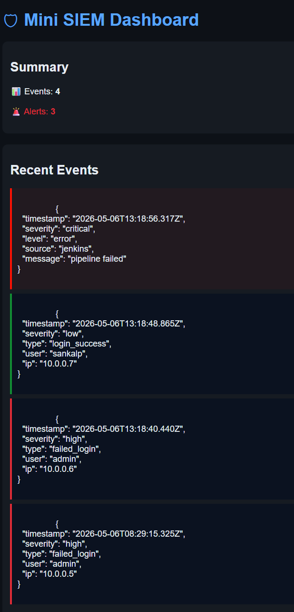

# 🚀 Final Demo — End-to-End Platform Walkthrough

---

## What This Demo Shows

A complete walkthrough of the DevSecOps SIEM Platform running live — from a single startup command through to real cloud logs appearing in the security dashboard.

---

## Demo Flow

```
1. Single command starts the entire platform
2. Kubernetes pods verified — 2 replicas running
3. Git push triggers Jenkins automatically via webhook
4. All 3 Jenkins jobs complete successfully
5. AWS EC2 ships real system logs to SIEM
6. SIEM dashboard shows live events with severity classification
```

---

## Step 1 — Platform Startup

A single script starts Jenkins, Kubernetes port-forward, and ngrok:

```bash
cd ~/github
./scripts/start-platform.sh
```

Output:
```
============================================
   DevSecOps Platform — Starting Up...
============================================
[1/3] Starting Jenkins container...      ✔ Jenkins started
[2/3] Starting kubectl port-forward...   ✔ Port-forward running
[3/3] Starting ngrok tunnel...           ✔ ngrok tunnel active
============================================
  Jenkins (local):    http://localhost:8080
  SIEM Dashboard:     http://localhost:8081
  ngrok Web UI:       http://127.0.0.1:4040
============================================
```

---

## Step 2 — Kubernetes Verification

```bash
kubectl get pods
# devsecops-app-7d58c886cf-ffxsg   1/1   Running   14d
# devsecops-app-7d58c886cf-vxsrm   1/1   Running   14d

kubectl get deployments
# devsecops-app   2/2   2   2   15d

kubectl get svc
# devsecops-app-service   NodePort   10.96.121.234   80:30564/TCP   15d
```

Two replicas running. Self-healing — if a pod dies, Kubernetes restarts it automatically.

---

## Step 3 — Live Webhook Trigger

```bash
cd ~/github/devsecops-projects/devsecops-siem-project
git commit --allow-empty -m "live demo trigger"
git push origin main
```

Watch Jenkins at `http://localhost:8080` — within seconds:

```
Started by GitHub push by sankalpdevopstrain
```

Job 1 → Job 2 → Job 3 complete automatically.

---

## Step 4 — Jenkins Pipeline Evidence


All three jobs completing successfully:


**Job 1 — CI Build:**


**Job 2 — CD Push:**


**Job 3 — CD Deploy:**


---

## Step 5 — EC2 Real Logs

SSH into the EC2 and run real system commands:

```bash
ssh -i ~/.ssh/devsecops-key.pem ubuntu@3.8.210.149

# Run the full activity script
./ec2-activity.sh

# Or use the log helper manually
sudo apt-get update
log "Manual apt-get update completed"
```

The SIEM dashboard at `http://localhost:8081` shows real EC2 events instantly.

---

## Step 6 — SIEM Dashboard

**Initial state:**



**Live events with alerts:**



Events shown include:
- Real EC2 system activity (apt update, service status, open ports)
- Simulated failed SSH login attempts (HIGH severity)
- Simulated memory and disk threshold breaches (CRITICAL severity)
- Jenkins build events (LOW severity)

---

## Demo Talking Points

**On the startup script:**
> "Rather than manually starting each component across multiple terminal windows, I wrote a platform automation script that orchestrates the full startup sequence in one command — with built-in health checks."

**On Kubernetes:**
> "Two replicas are running for resilience. If a pod fails, Kubernetes restarts it automatically. The RESTARTS column shows it has already self-healed multiple times."

**On the webhook:**
> "I just pushed a commit — watch Jenkins. The webhook fires automatically, Job 1 starts, and the full pipeline runs without me touching Jenkins at all."

**On the SIEM dashboard:**
> "This is the part I built beyond the training. It ingests real events from EC2, Jenkins, and GitHub — classifies them by severity — and surfaces alerts exactly like a production SOC would with Splunk or Microsoft Sentinel."

**On Terraform:**
> "The EC2 instance was provisioned entirely through Terraform. I ran three commands — init, plan, apply — and the VPC, subnet, security group, key pair, and EC2 were all created automatically."

---

## Future Roadmap

| Item | Description |
|---|---|
| Persistent storage | Replace in-memory logs with MongoDB |
| Auto-refresh dashboard | WebSocket real-time updates |
| Jenkins on EC2 | Deploy Jenkins to cloud via Terraform |
| ELK integration | Replace custom dashboard with full ELK stack |
| Alert notifications | Slack/email on high and critical events |
