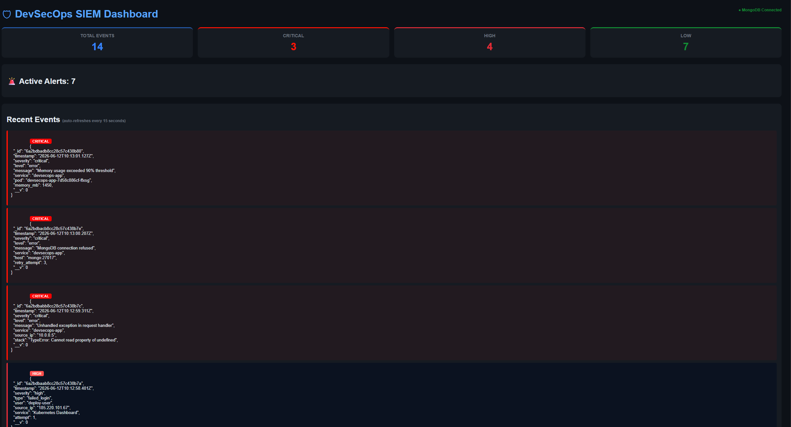

# 10 — MongoDB Persistent Storage

## Overview

Prior to this implementation, the SIEM dashboard stored all log events in memory — meaning every pod restart wiped the entire log history. This was replaced with MongoDB running as a Kubernetes pod, providing persistent storage that survives restarts, redeployments, and crashes.

---

## Why MongoDB?

| Before | After |
|---|---|
| Logs stored in `let logs = []` (RAM) | Logs stored in MongoDB (disk) |
| All logs lost on pod restart | Logs persist across restarts |
| No query capability | Full query and filter support |
| Not production-ready | Production-grade storage |

In a real SIEM (Splunk, IBM QRadar, Elastic SIEM), every security event is stored permanently so analysts can investigate incidents days, weeks, or months later. MongoDB brings this capability to this project.

---

## Implementation

### Kubernetes Deployment

MongoDB runs as a dedicated pod inside the same Kubernetes cluster as the SIEM dashboard, defined in `k8s/mongodb-deployment.yaml`:

- **Image**: `mongo:6.0`
- **Service**: `mongodb-service` (ClusterIP, port 27017)
- **Storage**: Persistent volume mounted at `/data/db`

The SIEM app connects via the environment variable `MONGO_URL=mongodb://mongodb-service:27017/siem`, injected through `k8s/deployment.yaml`.

### Mongoose Schema

Log events are stored using a flexible Mongoose schema that accepts any incoming fields whilst enforcing core structure:

```javascript
const logSchema = new mongoose.Schema({
    timestamp: { type: String, required: true },
    severity:  { type: String, default: 'low' },
    source:    { type: String },
    type:      { type: String },
    message:   { type: String },
    host:      { type: String }
}, { strict: false });
```

The `strict: false` option allows additional fields (such as `cpu_pct`, `process_count`, `established_connections`) to be stored without schema changes.

### API Endpoints

```
POST /logs      Ingest and persist a log event
GET  /logs      Retrieve all logs (sorted by timestamp)
DELETE /logs    Clear all logs from the database
```

---

## Verification

The screenshot below shows the SIEM dashboard after a pod restart — all 14 logs remain intact, confirming MongoDB persistence is working correctly.



---

## Pods Running

```bash
kubectl get pods
```

```
NAME                             READY   STATUS    RESTARTS   AGE
devsecops-app-7d45865b96-94hwh   1/1     Running   0          6s
devsecops-app-7d45865b96-hrrrg   1/1     Running   0          5s
mongodb-7f595f7c5b-f5fdc         1/1     Running   0          52m
```

Both the SIEM app replicas and the MongoDB pod run simultaneously inside Kubernetes.

---

## Key Takeaway

Restarting the deployment no longer clears logs. The `DELETE /logs` endpoint now provides the only way to clear the dashboard — demonstrating proper separation between application state and infrastructure lifecycle.
