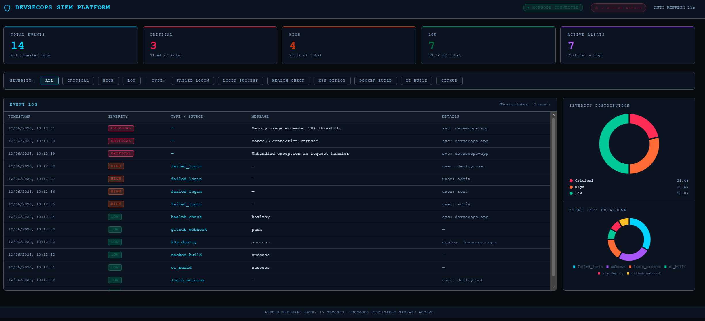
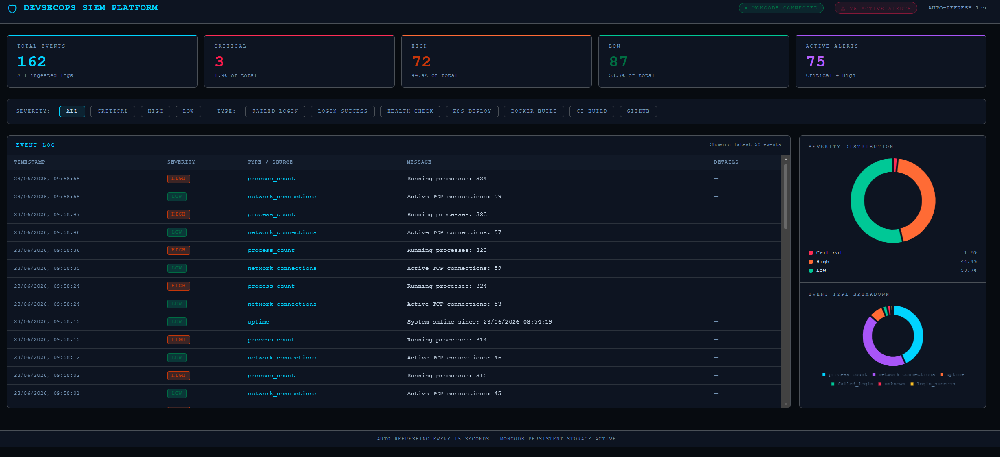
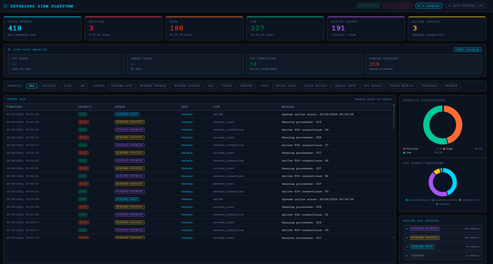

# 11 — Professional SIEM Dashboard

## Overview

The SIEM dashboard was upgraded from a basic event list to a professional-grade cybersecurity monitoring interface, incorporating real-time charts, multi-source filtering, live host metrics, and persistent MongoDB storage.

---

## Dashboard Features

### Stat Cards
Six summary cards at the top of the dashboard provide an at-a-glance operational picture:

| Card | Description |
|---|---|
| Total Events | All ingested log events across all sources |
| Critical | Count and percentage of critical severity events |
| High | Count and percentage of high severity events |
| Low | Count and percentage of low severity events |
| Active Alerts | Combined critical + high count (pulsing red when non-zero) |
| Active Sources | Number of unique log sources currently ingesting |

### Live Host Metrics Panel
A dedicated panel displays real-time metrics from connected host machines:

- **CPU Usage** — colour-coded green/amber/red by threshold
- **Memory Usage** — percentage and raw MB used vs total
- **TCP Connections** — active established network connections
- **Running Processes** — total system process count
- **Host Name** — displayed prominently (e.g. `Sankalp`, `EC2`)

### Filter Bar
Events can be filtered by:
- **Severity** — All / Critical / High / Low
- **Source** — Windows Host / Windows Network / Windows Process / EC2 / GitHub / Jenkins
- **Type** — Failed Login / Login Success / Health Check / K8s Deploy / System Metrics / Processes / Network

### Event Log Table
A scrollable table showing the latest 100 events with columns:

| Column | Description |
|---|---|
| Timestamp | Date and time in British format (dd/mm/yyyy) |
| Severity | Colour-coded badge (Critical / High / Low) |
| Source | Colour-coded source badge showing origin system |
| Host | Name of the machine that generated the event |
| Type | Event type classification |
| Message | Human-readable event description |

### Severity Distribution Chart
A doughnut chart showing the percentage breakdown of Critical, High, and Low events across all ingested logs.

### Log Source Breakdown Chart
A doughnut chart showing the distribution of events by source — useful for identifying which systems are generating the most activity.

### Active Sources Panel
A live list of all connected log sources with individual event counts, each showing a pulsing green indicator confirming active ingestion.

---

## Dashboard Evolution

### Stage 1 — Basic Cyber Security Style Dashboard

Initial upgrade from a plain list to a dark SOC-aesthetic dashboard with severity colour coding.



---

### Stage 2 — Multi-Source Integration

Windows host machine connected as a live log source alongside existing Jenkins, GitHub, and Kubernetes events.



---

### Stage 3 — Host Identity and Source Labelling

Each log row now displays the originating host name and source system, making it immediately clear which machine generated each event.



---

## Log Sources

| Source | Host | Events |
|---|---|---|
| `windows-host` | Sankalp | System uptime, disk usage |
| `windows-network` | Sankalp | Active TCP connections |
| `windows-process` | Sankalp | Running process count |
| `ec2` | AWS EC2 | Real cloud system logs |
| `github` | — | Webhook push events |
| `jenkins` | — | CI/CD build and deploy events |
| `kubernetes` | — | Pod deployment events |

---

## Severity Classification

| Condition | Severity |
|---|---|
| `type: failed_login` | HIGH |
| `level: error` | CRITICAL |
| `type: login_success` | LOW |
| `type: health_check` | LOW |
| `process_count > 300` | HIGH |
| `cpu_pct > 85` | CRITICAL |
| `cpu_pct > 60` | HIGH |

---

## Auto-Refresh

The dashboard refreshes automatically every 15 seconds via an HTML meta refresh tag, ensuring the event log, stat cards, and charts always reflect the latest data without manual intervention.

---

## API Endpoints

```
POST   /logs            Ingest a log event
GET    /logs            Retrieve all logs (JSON, sorted by timestamp)
DELETE /logs            Clear all logs from MongoDB
GET    /health          Health check — returns MongoDB connection status
GET    /                Live dashboard UI
POST   /github-webhook  GitHub webhook receiver
```
